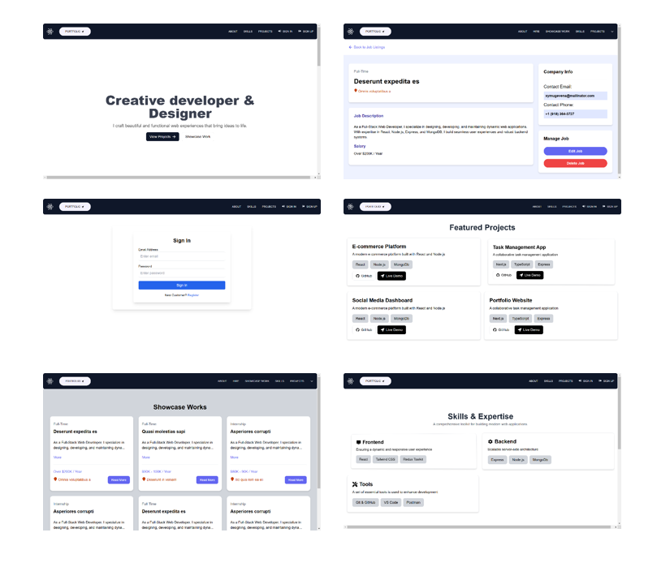

# Empowering Careers, Simplifying Hiring

Connect with top opportunities! Post new jobs, explore all hiring options, and discover in-demand skills. Only **logged-in** users can access and manage hiring features.



## Atlas

- This project currently uses a local MongoDB database. However, if needed, you can use MongoDB Atlas for deployment and other use cases.

## Env Variables

```
NODE_ENV=development
PORT=4500
MONGO_URI=Your mongo URI
JWT_SECRET=Your secret key
```
## Install Dependencies (frontend & backend)

```
npm i
cd frontend
npm i
```

## Run ( Using concurrently package )

```
# This cmd run both frontend & backend  
npm run dev 
```

## Build & Deploy

```
cd frontend
npm run build
```